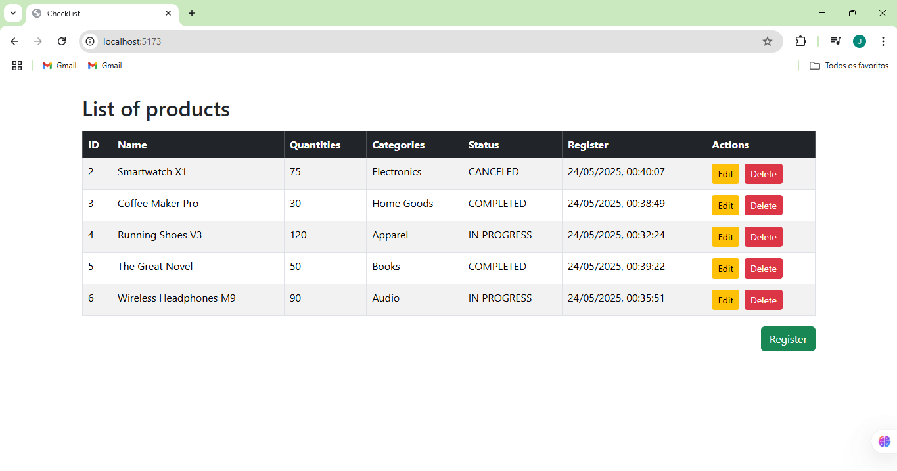
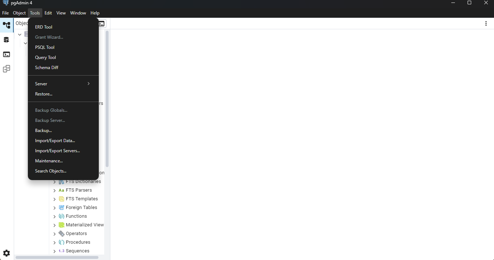
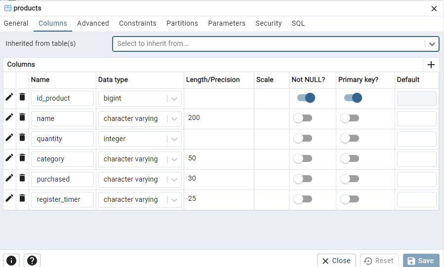
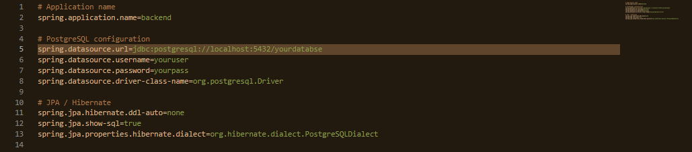

# ✅ CheckList - Full-Stack
<div align="left">


</div>

## 📌 Aboute the Project

**CheckList** is a **Full-Stack** application developed as a practical project for the **Final Course Work (TCC)** of the **Systems Analysis and Development** program at **SENAI**. Started on **May 23, 2025** by **João Pedro Dala Dea Mello**, the project aims to apply knowledge in front-end, back-end, and database technologies to create a functional application for managing product lists. Designed for users who want to organize purchases or inventories, the application allows for registering, listing, editing, and deleting products in a simple and intuitive way, demonstrating the integration of modern technologies.



## 📋 Features

1. **Product Registration**: Allows users to add products with name, quantity, and category, making it easier to organize customized lists.
2. **Product Listing**: Displays all products in a clean and organized interface with sorting options.
3. **Product Editing**: Enables users to update existing product information, providing flexibility.
4. **Product Deletion:**: Allows for safely removing unnecessary products.
5. **Responsive Interface**: Ensures usability on both mobile devices and desktops, adapting to different screen sizes.

## 🛠️ Technologies Used

| **Layer**      | **Technology** | **Version** | **Description**                                    |
| -------------- | -------------- | ----------- | -------------------------------------------------- |
| Front-End      | React          | 19.x        | JavaScript library for building dynamic interfaces |
| Front-End      | Bootstrap      | 5.x         | CSS framework for responsive design                |
| Front-End      | Axios          | 1.x         | HTTP client for API communication                  |
| Back-End       | Spring Boot    | 3.x         | Java framework for building RESTful APIs           |
| Back-End       | DTOs           | -           | Data Transfer Objects to standardize data          |
| Banco de Dados | PostgreSQL     | 17.x        | Robust and scalable relational database            |

### 🌐 Languages
- HTML
- CSS
- JavaScript
- Java 21

## 📂 Project Structure

- `/frontend`: Interface developed with React, organized into components, pages, and services for API calls, styled with Bootstrap and integrated with Axios.

- `/backend`: RESTful API built with Spring Boot, following a layered architecture consisting of:
  - **Model**: Defines the database entities.
  - **Repository**: Interface for accessing and manipulating PostgreSQL data.
  - **Service**: Contains business logic between controllers and repositories.
  - **Controller**: Manages HTTP requests and API responses.
  - **DTO**: Data Transfer Objects to standardize communication between front-end and back-end.

## 🚀 Installation & Execution

### ✅ Prerequisites

Make sure the following tools are installed on your machine:

- [Node.js](https://nodejs.org) — (recommended version: LTS)
- [Java 21+](https://www.oracle.com/java/technologies/javase/jdk21-archive-downloads.html)
- [PostgreSQL](https://www.postgresql.org)
- [Maven](https://maven.apache.org) — (used for back-end build)
- [Visual Studio Code](https://code.visualstudio.com/) or any other IDE (IntelliJ, Eclipse, NetBeans)

> 💡 **Tip**: After ensuring prerequisites, clone or download this repository to your machine and follow the steps below.

---

### 🗄️ Database (PostgreSQL)

#### 1. Create the Database

- **Using pgAdmin 4**:
  1. Open **pgAdmin 4** and click on **Servers** in the side menu.
  2. Enter the server password if prompted.
  3. Right-click **Databases**  and select **Create > Database**.
  4. Name the database `checklist` (recommended) and click **Save**.
     

- **Using Query Tool**:
  1. In pgAdmin 4, go to **Tools > Query Tool**.
     
  2. Execute the following SQL command:
     ```sql
     CREATE DATABASE checklist;
---

#### 2. Create the products Table
After creating the ``checklist`` or another database, create the ``products`` table with the following fields:

- **Using pgAdmin 4**:

1. Expand the ``checklist`` database > Schemas > public > Tables.

2. Right-click and select **Create > Table**, name it ``products``.

3. Add the columns::

| Column           | Type                     | Properties                         |
|------------------|--------------------------|-------------------------------------|
| `id_product`     | `bigint`                 | Primary Key, Identity (By Default) |
| `name`           | `character varying(200)` | Product name                        |
| `quantity`       | `integer`                | Quantity                            |
| `category`       | `character varying(50)`  | Product category                    |
| `purchased`      | `character varying(30)`  | Whether the product was purchased   |
| `register_timer` | `character varying(25)`  | Registration timestamp              |




4. Click **Save** for create the table

- **Using Query Tool**: 
  
  Run the SQL command below in the Query Tool to create the table
  **products**:

    ```sql
    CREATE TABLE products(
    id_product BIGINT PRIMARY KEY NOT NULL GENERATED BY DEFAULT AS IDENTITY, 
    name VARCHAR(200), 
    quantity INTEGER, 
    category VARCHAR(50), 
    purchased VARCHAR(30), 
    register_timer VARCHAR(25)
    );
> ℹ️ **Note**: The field ``id_product`` uses ``GENERATED BY DEFAULT AS IDENTITY`` for auto-increment behavior.
---

#### 3. Verify Database Server Status

- Make sure PostgreSQL is running:

1. In pgAdmin 4, check if the server status is **green** (connected).
2. If not, start the server via command line (``pg_ctl start``) or system services.
3. Enter the PostgreSQL user password if prompted.
---
### 🔧 Backend (Spring Boot)

1. Go to the back-end folder:
   ```bash
   cd backend
2. Configure the``application.properties`` file with your PostgreSQL credentials.

   

3. Run the project with Maven:
   ```bash
   mvn spring-boot:run
The app will be available at `http://localhost:8080`
---

### 💻 Frontend (React)

1. Go to the front-end folder:
   ```bash
   cd frontend
2. Install dependencies:
   ```bash
   npm install
3. Start the application:
   ```bash
   npm run dev
The app will be available at `http://localhost:5173`
---

## 📚 Learnings and Challenges

- **Front-End & Back-End Integration**: Configuring HTTP calls with Axios and handling API responses.
- **Database Management**: Creating and manipulating PostgreSQL tables to support app features.
- **Challenges**: Setting up the environment, integrating Spring Boot with PostgreSQL, and ensuring responsive design with Bootstrap.
---

## 🧑‍💻 Author

**João Pedro Dala Dea Mello**  
Student of Systems Analysis and Development — SENAI
- GitHub: [github.com/joaopedro08-dev](https://github.com/joaopedro08-dev)  
- Email: joaopedrodaladeamello098@gmail.com
